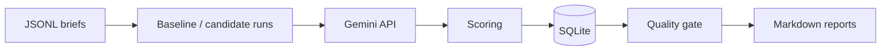

# Evaluation and governance for LLM campaign suggestions

Portfolio sample: an **offline evaluation gate** for LLM-generated campaign actions—same test briefs, **baseline vs. candidate** prompts, **scoring**, **quality gate**, persisted runs and reports.

**More narrative:** [`docs/project-story.md`](docs/project-story.md) · **Stakeholder brief:** [`docs/management-brief.md`](docs/management-brief.md) · **PDFs:** build from [`report/`](report/README.md) (`LEGO_Case_Study_Report.tex`, `Project_Development_Report.tex`)

---

## Introduction

Changing an LLM’s instructions for **campaign planning** is a **release decision**: a new prompt can look better on some briefs and **worse** on others (e.g. multi-audience, sustainability). This repository implements a **small, repeatable pipeline**: fixed inputs → generate outputs for two prompt versions → **score** → **aggregate** → apply **explicit rules** → **record** results. The goal is **evidence** for *ship / don’t ship / scope*, not a product UI.

---

## Scope

| In scope | Out of scope |
|----------|----------------|
| JSONL **test suites** (`data/`, e.g. `validation_suite.jsonl`) | Production traffic or LEGO internal systems |
| **Baseline vs. candidate** runs via scripts | Full MLOps platform (CI, experiment registry, Databricks) |
| **Scoring** (judge model + deterministic checks) + **weighted aggregate** | Human review workflows at scale |
| **Quality gate** (`PROMOTE` / `BLOCK` / `PROMOTE_CONDITIONAL`) with thresholds | Automated routing of live requests by brief type |
| **SQLite** run history; **Markdown** reports | Customer or confidential data |

**Stack:** Python 3.10+, **stdlib** runtime (Gemini **REST** via `urllib`), **SQLite**, CLI scripts under `scripts/`.

---

## Method

1. **Inputs:** Each line in the JSONL suite is one brief + constraints (`eval_runner.py`).
2. **Generation:** For each prompt version, call **Gemini** (`llm_client.py`) with the same cases; store raw text and latency.
3. **Scoring:** Per output: relevance/actionability (judge), structure/constraints (rules) → **aggregate score** (`scoring.py`).
4. **Persistence:** Runs, outputs, and scores in **SQLite** (`db.py`).
5. **Gate:** Compare **mean** baseline vs. candidate metrics; evaluate thresholds + variance rule (`gate.py`).
6. **Reporting:** `generate_report.py` writes [`reports/latest_report.md`](reports/latest_report.md); optional segment / observability scripts.

**Process overview**



---

## Results

Reference evaluation (checked-in narrative; **re-running** creates new run IDs):

| | |
|---|---|
| **Suite** | 8 briefs — [`data/validation_suite.jsonl`](data/validation_suite.jsonl) |
| **Prompts** | `v1-baseline` vs. `v3-user-candidate` |
| **Runs (reference)** | Baseline **21**, candidate **22** |
| **Gate** | **BLOCK** (not safe as **global** default) |
| **Confidence** | **1.00** (*n* = 8; variance gate applied) |

**Mean scorecard**

| Metric | Baseline | Candidate | Δ |
|--------|----------|-----------|---|
| **Aggregate** | **4.844** | **4.542** | **−0.302** |
| Actionability | 4.750 | 4.300 | −0.450 |
| Constraints | 7.501 | 7.085 | −0.416 |

**Segmentation:** Candidate **gains** on a launch-style case (**TC01**, ~**+1.25** aggregate vs. baseline) but **regresses** on a multi-audience sustainability case (**TC10**, ~**−3.46**). Detail: [`FINAL_DECISION_STORY.md`](FINAL_DECISION_STORY.md), [`VALIDATION_SUITE_SUMMARY.md`](VALIDATION_SUITE_SUMMARY.md), [`reports/segment_report.md`](reports/segment_report.md).

**Artifacts:** [`reports/latest_report.md`](reports/latest_report.md) (failed checks: aggregate drop > 5%, actionability > 8%, variance rule).

---

## Recommendations

1. **Do not** promote the reference candidate (`v3-user-candidate`) as the **default for all brief types** on this evidence—portfolio mean drops and strong segment regression on **TC10**.
2. **Prefer scoped rollout or routing**—e.g. allow the candidate path only where evaluation shows stability (illustratively **launch / single-audience**-style briefs), keep baseline elsewhere until the weak segments improve.
3. **Iterate the candidate** against multi-audience / sustainability / stress cases, or maintain **separate prompt paths** by campaign type.
4. **Keep segmented evaluation** in the release process so **local wins** do not mask **global risk**.

---

## Repository layout

| Path | Purpose |
|------|---------|
| `src/` | Config, LLM client, runner, scoring, DB, gate, reporting |
| `scripts/` | `run_baseline.py`, `run_candidate.py`, `generate_report.py`, helpers |
| `data/` | Test suites (JSONL) |
| `reports/` | Generated Markdown |
| `report/` | LaTeX → PDF case studies |
| `docs/` | `project-story.md`, `management-brief.md`, `case-study.md` |

---

## Reproducing the evaluation

**Requirements:** Python 3.10+, [Gemini API key](https://aistudio.google.com/apikey). Optional: pdfLaTeX or Overleaf for PDFs.

```bash
cp env.example .env   # set Gemini_API_KEY
python scripts/run_baseline.py
python scripts/run_candidate.py
python scripts/generate_report.py
```

See `src/config.py` for optional env vars. **PDFs:** `cd report && ./build_pdf.sh`

---

## Security and data

`.env` is not committed. No confidential LEGO data in this sample.

---

## License

See [LICENSE](LICENSE).
