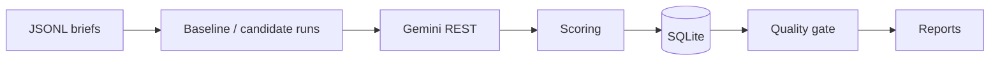

# Portfolio: LLM evaluation & governance (Analytics Engineer application)

This repository is a **work sample** for the **Analytics Engineer** role in **Innovation & Automation** (Analytics & Insights): an **offline evaluation gate** for LLM-generated **campaign** suggestions—structured **benchmarks**, **baseline vs. candidate** comparison, **quality gates**, and **auditable** outputs.

**Also read:** [`docs/project-story.md`](docs/project-story.md) · [`docs/management-brief.md`](docs/management-brief.md) · PDFs: [`report/README.md`](report/README.md)

---

## Context

The posting describes a team of four **building from scratch** in **Innovation & Automation**: **evaluation and governance systems** for products that support **commercial decisions** (e.g. **campaign optimisation**), with partners such as the **Data Office** and **Digital Product**. The team sits between **Analytics Engineering** (data foundation) and **Analytics Interface** (business products)—shaping **standards, evaluation frameworks, governance, and tooling**.

**Themes from the role that this sample speaks to**

| Theme in the posting | In plain terms |
|----------------------|----------------|
| **Evaluation frameworks** for LLM / agent outputs | Benchmarks + scoring when there is no single “correct” answer |
| **Structured regression** | Same inputs, **two** prompt versions, comparable metrics |
| **Observability** | Run history, reports, trend-style views from stored runs |
| **AI governance / quality gates** | Explicit **PROMOTE** / **BLOCK** rules with documented reasons |
| **Python, SQL, REST** | Python codebase; **SQLite** + SQL-shaped queries; **Gemini REST API** |
| **Lifecycle** (not only training) | Versioned prompts, repeatable runs, decision trail |

**Out of scope in this repo (called out as natural next steps):** Databricks deployment pipelines, **GitHub Actions** CI, full **drift** monitoring in production—the pattern here is sized for a **portfolio proof** and extends in those directions.


---

## Mapping: posting → this repository

| Responsibility / requirement | Where it shows up here |
|------------------------------|-------------------------|
| Automated **benchmarks** + regression-style comparison | `data/*.jsonl` suites; `run_baseline.py` / `run_candidate.py`; same briefs for two prompt versions |
| Evaluation without a single ground-truth label | Rubric + **judge model** + deterministic checks (`scoring.py`) |
| **Observability** / behaviour vs. outcomes | **SQLite** run store (`db.py`); Markdown reports; optional `observability_report` |
| **Quality gates** / governance | `gate.py` — thresholds, **BLOCK** / **PROMOTE** / conditional paths, explicit failed checks |
| **Python** | `src/`, typed style, small modules |
| **SQL** | SQLite schema; analytical aggregates in report scripts |
| **REST** consumer | `llm_client.py` → Gemini **HTTP** API |
| **Lifecycle** (change control, not one-off demos) | Prompt versions in config; repeatable CLI; documented reference run |
| Reusable **templates** | Scripts as entrypoints; config-driven thresholds |
| Databricks / CI / production drift | **Not implemented** — noted as extensions in **Scope** and **Recommendations** |

---

## Introduction

**Commercial context:** **Campaign optimisation**-style workflows increasingly use LLMs to turn briefs into actions. **Changing a prompt** is a **release decision**: the new version can improve some brief types and **regress** others. **Anecdotal** review (“it reads better”) is not enough for **governance**.

**What this repo is:** A **minimal pipeline**: fixed campaign briefs → generate outputs for a **baseline** and a **candidate** prompt → **score** → **aggregate** → apply **explicit gate rules** → **persist** runs and write **reports**. It demonstrates **evaluation + observability + governance** in one coherent artefact—aligned with the **Innovation & Automation** remit above.

---

## Scope

| In scope | Out of scope (posting-aligned “next steps”) |
|----------|-----------------------------------------------|
| JSONL **test suites** (`data/`, e.g. `validation_suite.jsonl`) | Live LEGO systems, production traffic, confidential data |
| **Baseline vs. candidate** runs | **Databricks** deployment, model serving endpoints |
| **Scoring** + **weighted aggregate** | Large-scale human-in-the-loop labelling |
| **Quality gate** with thresholds | Full **CI/CD** (e.g. **GitHub Actions**) in this repo |
| **SQLite** + Markdown / PDF artefacts | Automated **drift detection** on live telemetry |

**Stack:** Python 3.10+, **stdlib** HTTP client to **Gemini REST**, **SQLite**, CLI under `scripts/`.

---

## Method

1. **Inputs:** JSONL rows = brief + constraints (`eval_runner.py`).
2. **Generation:** Gemini **REST** (`llm_client.py`); one run per prompt version; store raw output + latency.
3. **Scoring:** Judge JSON scores + rule-based checks → per-case **aggregate** (`scoring.py`).
4. **Persistence:** Runs / outputs / scores in **SQLite** (`db.py`).
5. **Gate:** Mean metrics vs. thresholds + variance rule (`gate.py`) — **reliability as rules**, not a compliance checkbox.
6. **Reporting:** `generate_report.py` → [`reports/latest_report.md`](reports/latest_report.md); optional segment / observability scripts.



---

## Results

Reference run (documented in-repo; new API runs get new IDs):

| | |
|---|---|
| **Suite** | 8 briefs — [`data/validation_suite.jsonl`](data/validation_suite.jsonl) |
| **Prompts** | `v1-baseline` vs. `v3-user-candidate` |
| **Runs** | Baseline **21**, candidate **22** |
| **Gate** | **BLOCK** (not endorsed as **global** default) |
| **Confidence** | **1.00** (*n* = 8) |

**Mean scorecard**

| Metric | Baseline | Candidate | Δ |
|--------|----------|-----------|---|
| **Aggregate** | **4.844** | **4.542** | **−0.302** |
| Actionability | 4.750 | 4.300 | −0.450 |

**Segmentation:** Gain on **TC01** (launch-style); large regression on **TC10** (sustainability / multi-audience). Evidence: [`FINAL_DECISION_STORY.md`](FINAL_DECISION_STORY.md), [`reports/latest_report.md`](reports/latest_report.md), [`reports/segment_report.md`](reports/segment_report.md).

---

## Recommendations

1. **Product / governance:** Do **not** promote the reference candidate as the **default for all brief types** without further work—portfolio regression and **TC10** segment failure.
2. **Scoped use:** Prefer **targeted** rollout or **separate prompt paths** where evaluation shows stability (e.g. launch-style briefs); iterate on multi-audience / stress cases.
3. **Team-shaped next steps (posting):** Wire the suite into **CI (GitHub Actions)**; connect to **experiment tracking**; when platforms exist, align with **Databricks** patterns and **Data Office** standards for analytics adoption.

---

## Repository layout

| Path | Purpose |
|------|---------|
| `src/` | Config, LLM client, runner, scoring, DB, gate, reporting |
| `scripts/` | Baseline/candidate runs, report generation |
| `data/` | JSONL test suites |
| `reports/` | Generated Markdown |
| `report/` | LaTeX → PDF case studies |
| `docs/` | `project-story.md`, `management-brief.md`, `case-study.md` |

---

## Reproducing the evaluation

**Requirements:** Python 3.10+, [Gemini API key](https://aistudio.google.com/apikey).

```bash
cp env.example .env   # set Gemini_API_KEY
python scripts/run_baseline.py
python scripts/run_candidate.py
python scripts/generate_report.py
```

Optional env vars: `src/config.py`. **PDFs:** `cd report && ./build_pdf.sh`

---

## Security and data

`.env` is not committed. This sample contains **no** confidential LEGO data.

---

## License

See [LICENSE](LICENSE).
