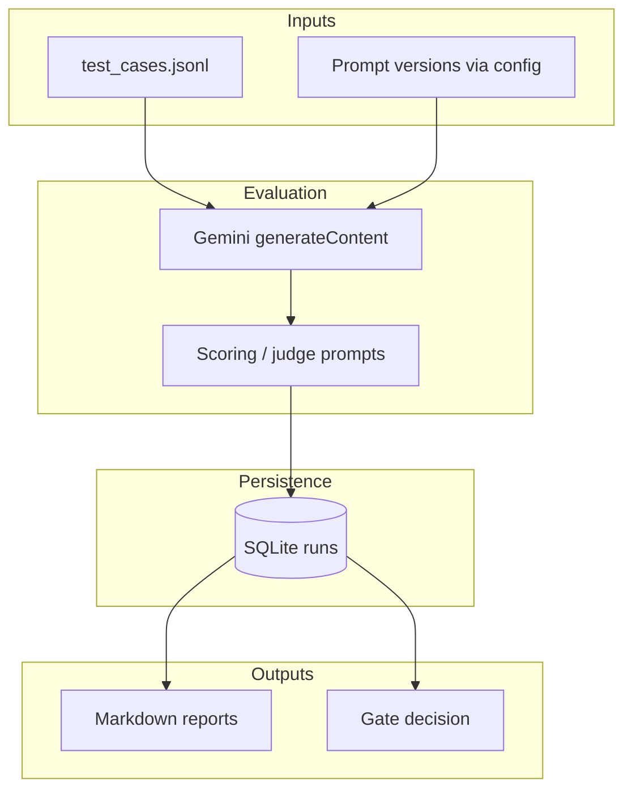

# Evaluation and governance for LLM campaign suggestions

**Stakeholder / manager conversation:** use **[`docs/management-brief.md`](docs/management-brief.md)** as the narrative spine (problem, outcome, boundaries); use this README for technical detail and reproduction.

---

This repository is a self-contained **Analytics Engineering** sample: a release-style **evaluation gate** for LLM-generated campaign recommendations. The quickest path to understand the work is the **case study PDF** (source in [`report/LEGO_Case_Study_Report.tex`](report/LEGO_Case_Study_Report.tex); build instructions in [`report/README.md`](report/README.md)), then [`docs/case-study.md`](docs/case-study.md) and the code under `src/`.

---

## What you are looking at

| Area | What is implemented |
|------|----------------------|
| Evaluation | JSONL test suite; identical inputs for baseline vs. candidate; rubric-based scoring with a judge model |
| Regression | Aggregate and per-case comparisons; report artifacts for trends |
| Governance | Explicit gate outcomes (`PROMOTE` / `BLOCK` / conditional paths) driven by thresholds |
| Observability | Run history in SQLite; Markdown reports under `reports/` |
| Engineering | Python 3.10+, stdlib only for runtime (Gemini via REST); repeatable CLI entrypoints |

---

## Results (reference evaluation)

The repository includes a **completed reference run** so you can judge both the *business outcome* (baseline vs. candidate prompts) and the *system behaviour* (gate + artifacts), without re-executing the suite.

### Baseline vs. candidate (prompt experiment)

| | |
|---|---|
| **Suite** | 8 campaign briefs — [`data/validation_suite.jsonl`](data/validation_suite.jsonl) |
| **Prompts** | Baseline `v1-baseline` vs. candidate `v3-user-candidate` |
| **Reference run IDs** | Baseline **21**, candidate **22** |
| **Gate decision** | **BLOCK** (candidate not safe to ship as global default) |
| **Confidence** | **1.00** (sample size *n* = 8; variance gate applied) |

**Mean scorecard** (same rubric scale as in [`reports/latest_report.md`](reports/latest_report.md)):

| Metric | Baseline | Candidate | Δ |
|--------|----------|-----------|---|
| Aggregate | **4.844** | **4.542** | **−0.302** |
| Actionability | 4.750 | 4.300 | −0.450 |
| Constraints | 7.501 | 7.085 | −0.416 |

**Segmentation (why the aggregate matters):** the candidate **improves** on a structured launch-style case (**TC01**, about **+1.25** aggregate points vs. baseline) but **regresses strongly** on a multi-audience sustainability scenario (**TC10**, about **−3.46** points). That pattern is exactly what **segmented evaluation** is meant to surface before a broad rollout. Full narrative: [`FINAL_DECISION_STORY.md`](FINAL_DECISION_STORY.md); detail: [`VALIDATION_SUITE_SUMMARY.md`](VALIDATION_SUITE_SUMMARY.md), [`reports/segment_report.md`](reports/segment_report.md).

### What the system produced (same reference run)

| Output | Role |
|--------|------|
| **SQLite run history** | Baseline and candidate runs, scores, and outputs stored for audit and comparison (`data/runs.sqlite` is gitignored locally; structure is defined in `src/db.py`). |
| **Markdown reports** | e.g. [`reports/latest_report.md`](reports/latest_report.md) — pairwise deltas, scorecard, **failed gate checks** (aggregate drop 6.23% > 5%, actionability drop 9.47% > 8%, variance stability), and proxy panel. |
| **Gate logic** | Threshold-based **BLOCK** with explicit reasons; variance gate active because *n* ≥ 5. |

Re-running the scripts with your own API key will create **new** run IDs; the numbers above stay valid as the **checked-in illustrative outcome** tied to the case study PDF.

---

## Architecture (high level)



---

## Repository layout

| Path | Purpose |
|------|---------|
| `src/` | Configuration, LLM client, evaluation runner, scoring, persistence, gates, reporting |
| `scripts/` | Baseline/candidate runs, report generation, run comparison |
| `data/` | Test suites (`test_cases.jsonl`, `validation_suite.jsonl`, …) |
| `reports/` | Example generated Markdown outputs |
| `report/` | LaTeX case study (PDF builds locally or via Overleaf; see `report/overleaf/`) |
| `docs/` | Case study and management brief |

Supporting narratives: [`FINAL_DECISION_STORY.md`](FINAL_DECISION_STORY.md), [`VALIDATION_SUITE_SUMMARY.md`](VALIDATION_SUITE_SUMMARY.md).

---

## Reproducing the evaluation (for technical review)

**Requirements:** Python 3.10+, and a Gemini API key from [Google AI Studio](https://aistudio.google.com/apikey). For a PDF from the LaTeX source: pdfLaTeX + TikZ, or Overleaf.

```bash
cd job-application-lego
cp env.example .env
# Set Gemini_API_KEY in .env (never committed; see .gitignore)
```

Optional variables are documented in `src/config.py` (`BASELINE_PROMPT_VERSION`, `CANDIDATE_PROMPT_VERSION`, `DATASET_PATH`, temperatures).

From the repository root:

```bash
python scripts/run_baseline.py
python scripts/run_candidate.py
python scripts/generate_report.py
```

Additional scripts: `compare_runs.py`, `generate_segment_report.py`, `generate_observability_report.py`.

**PDF:** `cd report && ./build_pdf.sh` produces `LEGO_Case_Study_Report.pdf` when a LaTeX toolchain is available.

---

## Security and data

API keys belong in `.env` locally; that file is **not** tracked. `env.example` shows the variable names only. This sample does not include confidential LEGO data.

---

## License

See [LICENSE](LICENSE).
