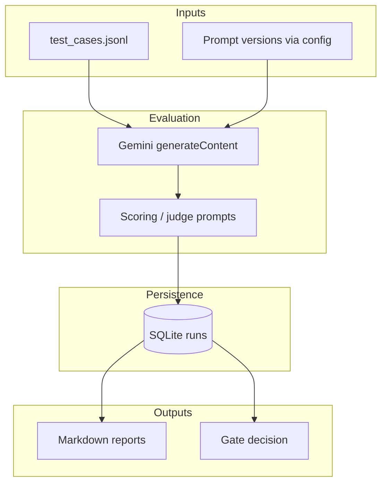

# Campaign suggestion reliability gate (LEGO Analytics Engineer — portfolio)

A small, production-minded **evaluation and governance** MVP for LLM-generated campaign recommendations: structured **baseline vs. candidate** runs, rubric scoring, **quality gates**, SQLite-backed run history, and Markdown reports—including **segmented** views so portfolio-level decisions are not fooled by narrow wins.

**Companion PDF:** build the case study from [`report/LEGO_Case_Study_Report.tex`](report/LEGO_Case_Study_Report.tex) (see [report/README.md](report/README.md)). Narrative summary for GitHub: [`docs/case-study.md`](docs/case-study.md).

---

## What this demonstrates

| Area | What is implemented |
|------|----------------------|
| Evaluation | JSONL test suite, same inputs for baseline/candidate, rubric + judge model |
| Regression | Compare aggregates and per-case scores; trend-style reporting |
| Governance | Explicit gate outcomes (`PROMOTE` / `BLOCK` / conditional paths) with thresholds |
| Observability | Run records, generated reports under `reports/` |
| Engineering | Typed Python, no extra pip deps (stdlib + Gemini REST API), repeatable CLI scripts |

---

## Architecture (high level)



---

## Repository layout

| Path | Purpose |
|------|---------|
| `src/` | Config, LLM client, evaluation runner, scoring, DB, gates, reporting |
| `scripts/` | `run_baseline.py`, `run_candidate.py`, report generators, `compare_runs.py` |
| `data/` | Test suites (`test_cases.jsonl`, `validation_suite.jsonl`, …) |
| `reports/` | Generated Markdown (e.g. latest run summary) |
| `report/` | LaTeX case study → **PDF** for recruiters / hiring managers |
| `docs/` | Short case-study write-up for the repo |

Phase notes (`PHASE*.md`, `FINAL_DECISION_STORY.md`) document design decisions and iteration history.

---

## Prerequisites

- **Python 3.10+**
- A **Gemini API key** ([Google AI Studio](https://aistudio.google.com/apikey))
- For the PDF: a LaTeX install with **pdfLaTeX** and TikZ (TeX Live / MacTeX / MiKTeX), or **Overleaf**

---

## Setup

```bash
cd job-application-lego
cp env.example .env
# Edit .env: set Gemini_API_KEY
```

Optional environment variables (see `src/config.py`): `BASELINE_PROMPT_VERSION`, `CANDIDATE_PROMPT_VERSION`, `DATASET_PATH`, `MODEL_TEMPERATURE`, `JUDGE_TEMPERATURE`.

---

## Run evaluation

From the project root (so `src` resolves correctly):

```bash
python scripts/run_baseline.py
python scripts/run_candidate.py
python scripts/generate_report.py
```

Other utilities:

```bash
python scripts/compare_runs.py
python scripts/generate_segment_report.py
python scripts/generate_phase4_report.py
```

---

## Build the PDF case study

```bash
cd report
./build_pdf.sh
# or: pdflatex -interaction=nonstopmode LEGO_Case_Study_Report.tex  # twice
```

Output: `report/LEGO_Case_Study_Report.pdf`. You can attach this PDF in applications or follow-up emails.

---

## Demo video (optional)

After you record a walkthrough, add the link near the top of this README, for example:

`**Demo:** [screen recording](https://…)`  

Suggested coverage: environment setup, one baseline + candidate run, opening `reports/latest_report.md`, and the gate decision story.

---

## Security

- **Never commit** `.env` or API keys. Use `env.example` as a template only.
- This repo is intended as a **portfolio sample**; it does not contain LEGO confidential data.

---

## License

See [LICENSE](LICENSE).
