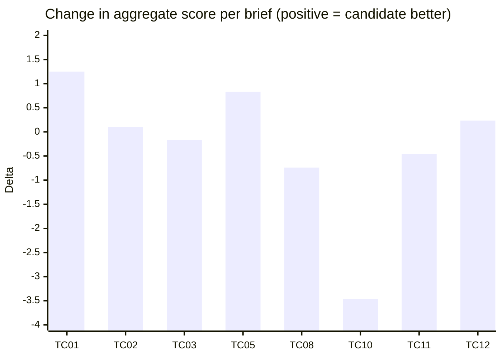

# What I built — LLM campaign assistant evaluation (work sample)

I’m sharing this repository as part of my application for **Analytics Engineer** in **Innovation & Automation** (Analytics & Insights). Below I explain **what this is**, **why it exists in a real organisation**, **how I run the experiment**, and **what I found**—before any heavy technical detail.

---

## The story (why I built it)

Imagine **Marketing** wants an internal assistant that turns **campaign briefs** into concrete actions. **Digital Product** might ship that assistant to users. **Analytics & Insights** (and partners like the **Data Office**) need to know that a **change to how the model is instructed** does not silently make outputs worse for some campaigns. I built a **small evaluation loop** that treats that change like a **release decision**: same test briefs, two versions of the instructions, measurable scores, a clear pass/fail-style outcome, and a written trail—so **you are not deciding on vibes alone**.

That is the thread from the job I’m applying to: **evaluation and governance** for LLM outputs that support **commercial** work (including **campaign optimisation**), with room to grow toward **observability**, **templates**, and **platform** patterns the team is shaping.

---

## What the experiment is (in plain terms)

**Inputs:** I use **eight** realistic campaign briefs (different goals: launch, promo, retention, sustainability, stress cases). They live in a structured file so every run uses the **same** questions.

**What I compare:** Two ways of instructing the same model—call them **baseline** and **candidate**—both asked to produce **three** actionable campaign moves per brief.

**What comes out:** For each answer I compute **scores** (relevance, actionability, respect for constraints, structure, then an overall score). I average across all eight briefs and also look **brief by brief**.

**What I decide:** I apply **fixed rules** (thresholds) to the averages. If the candidate breaks those rules, I **do not** treat it as “ready to replace the baseline everywhere.” The rules exist so the decision is **explainable**, not a gut call.

**Model:** I use **Google Gemini** (`gemini-2.5-flash`) for generation and for the scoring “judge.” The **engineering** contribution here is the **process** around the model: repeatable runs, storage, reports—not training a new foundation model.

---

## The process (what actually happens)

1. I **load** the eight briefs from the test suite.  
2. I run **baseline** instructions and collect one answer per brief.  
3. I run **candidate** instructions on the **same** briefs.  
4. I **score** every answer with the same rubric.  
5. I **average** the scores and compare baseline vs candidate.  
6. I apply the **release rules** (thresholds) to that comparison.  
7. I **write** a human-readable report and keep the run data so the evaluation can be **reviewed later**.

**Visual — flow (who feeds what)**

```
  ┌─────────────────┐
  │ 8 campaign      │
  │ briefs (fixed)  │
  └────────┬────────┘
           │
           ▼
  ┌────────────────────────────────────────────┐
  │ Same briefs fed twice (two instruction sets) │
  └────────┬───────────────────────┬───────────┘
           │                       │
           ▼                       ▼
   ┌───────────────┐       ┌───────────────┐
   │ Baseline      │       │ Candidate     │
   │ assistant     │       │ assistant     │
   └───────┬───────┘       └───────┬───────┘
           │                       │
           └───────────┬───────────┘
                       ▼
              ┌────────────────┐
              │ Score each     │
              │ answer         │
              └────────┬───────┘
                       ▼
              ┌────────────────┐
              │ Compare &      │
              │ apply rules    │
              └────────┬───────┘
                       ▼
              ┌────────────────┐
              │ Report + saved │
              │ run history    │
              └────────────────┘
```

---

## The two instruction sets (excerpts)

**Baseline (`v1-baseline`)** — shorter, “optimizer” style for LEGO launches:

> *You are a campaign optimizer for LEGO product launches. Provide exactly 3 actionable suggestions. Each suggestion must be clear, concise, and immediately executable. Respect budget/channel/segment constraints strictly.*  
> *(… plus brief + constraints, and a fixed output format with Action 1/2/3, Rationale, Target Segment, Expected Impact.)*

**Candidate (`v3-user-candidate`)** — planner-style, stricter structure:

> *You are an internal campaign planner supporting marketing teams. Your task is to convert a campaign brief and its constraints into EXACTLY 3 concrete campaign actions…*  
> *(… plus hard rules: channels, budget bands, all audiences, executable detail, no vague language.)*

**Full prompt text** (all versions, including the complete strings sent to the model): [`src/eval_runner.py`](src/eval_runner.py) — function `_prompt_template`.

---

## Results — portfolio averages (reference run)

I document a **reference run** (baseline run **21**, candidate run **22**) on the eight-brief suite. **Rule outcome:** **BLOCK** — the candidate is **not** supported as a **global** replacement for the baseline on this evidence.

**Mean scores (0–10 scale, across all 8 briefs)**

| Metric | Baseline | Candidate | Change |
|--------|----------:|----------:|-----------:|
| Overall (aggregate) | **4.844** | **4.542** | **−0.302** |
| Actionability | 4.750 | 4.300 | −0.450 |
| Relevance | 2.966 | 2.901 | −0.065 |
| Constraints | 7.501 | 7.085 | −0.416 |
| Structure | 4.165 | 3.955 | −0.210 |

**Chart — portfolio means (baseline vs candidate)**

```mermaid
xychart-beta
    title "Mean scores (baseline vs candidate), n=8 briefs"
    x-axis [Aggregate, Actionability, Relevance, Constraints, Structure]
    y-axis "Score" 0 --> 10
    bar [4.844, 4.75, 2.966, 7.501, 4.165]
    bar [4.542, 4.3, 2.901, 7.085, 3.955]
```



---

## Results — every brief (not only one case)

The suite is **eight** briefs. **TC10** is **one** example where the candidate **collapsed**; **TC01** is **one** example where the candidate **helped**. The point is the **spread**: if you only looked at one happy case, you could green-light a change that fails elsewhere.

**Per-brief change in overall score (candidate minus baseline)**

| Case | Brief type (short) | Baseline | Candidate | Change |
|------|-------------------|----------:|----------:|--------:|
| TC01 | Launch / awareness | 4.630 | 5.880 | **+1.250** |
| TC02 | Promo / high budget | 4.239 | 4.338 | +0.099 |
| TC03 | Retention | 4.838 | 4.671 | −0.167 |
| TC05 | Flagship conversion | 3.506 | 4.338 | +0.832 |
| TC08 | Flash sale | 5.959 | 5.219 | −0.740 |
| TC10 | Sustainability, dual audience | 7.343 | 3.881 | **−3.462** |
| TC11 | Stress / ambiguous | 4.968 | 4.505 | −0.463 |
| TC12 | Stress / conflicting goals | 3.271 | 3.506 | +0.235 |

**Chart — per-brief change (candidate − baseline)**



*(GitHub and some viewers render Mermaid; if the chart does not appear, use the table above.)*

---

## What I want you to take away

I built this **end-to-end** so that **changing the assistant is treated with the same discipline as a production change**: fixed inputs, comparable outputs, explicit rules, and a record. That is the kind of **system** that makes **evaluation and governance** real—not a slide about “AI governance.” The implementation is **Python**, **SQLite**, and a **REST** API to **Gemini**, because that matches how I would plug this into **broader analytics and platform** work with **Digital Product** and the **Data Office** as standards mature.

---

## Recommendations (how I would report upward)

1. **Do not** roll out the **candidate** prompt as the **default for all brief types** on this evidence—the **average** drops and the **TC10**-style failure is too large to ignore.  
2. **Scope** any pilot: e.g. only brief types where **repeated** evaluation shows stability (the **TC01** pattern is promising, not sufficient alone).  
3. **Iterate** the candidate on multi-audience and stress cases, or keep **two instruction paths** until metrics converge.  
4. **Next engineering steps** (aligned with how the team is building): automate this suite in **CI**, track runs over time, and eventually connect to **production** monitoring and **platform** conventions (e.g. **Databricks** / **MLflow**-style tracking) once data exists.

---

## Technical appendix (light)

| What | Where |
|------|--------|
| Prompt templates | [`src/eval_runner.py`](src/eval_runner.py) |
| Scoring & aggregate | [`src/scoring.py`](src/scoring.py) |
| Rules / thresholds | [`src/gate.py`](src/gate.py), [`src/config.py`](src/config.py) |
| Run history | SQLite (`src/db.py`); local DB file `data/runs.sqlite` is gitignored |
| Reports | [`reports/latest_report.md`](reports/latest_report.md) |
| Detailed numbers | [`VALIDATION_SUITE_SUMMARY.md`](VALIDATION_SUITE_SUMMARY.md), [`FINAL_DECISION_STORY.md`](FINAL_DECISION_STORY.md) |
| PDF write-ups | [`report/README.md`](report/README.md) |
| Longer narrative | [`docs/project-story.md`](docs/project-story.md), [`docs/management-brief.md`](docs/management-brief.md) |

**Reproduce (after you clone the repo):** Python 3.10+, set `Gemini_API_KEY` via `env.example` → `.env`, then run `scripts/run_baseline.py`, `scripts/run_candidate.py`, `scripts/generate_report.py`.

---

## Role context (job posting — reference)

<details>
<summary><strong>Analytics Engineer — Innovation & Automation (summary from posting)</strong></summary>

**Team:** Innovation & Automation within Analytics & Insights — building **evaluation and governance** for products that power **commercial decisions** (forecasting, pricing, **campaign optimisation**). Close work with **Data Office** and **Digital Product**; shaping **standards, frameworks, tooling**.

**Core themes:** evaluation frameworks for LLM outputs, observability, governance / quality gates, **Python**, **SQL**, **REST**, lifecycle beyond training, reusable templates and CI/CD.

**This sample:** offline evaluation gate, **benchmark-style** suite, **regression** comparison (baseline vs candidate), **scoring**, **SQLite** audit trail, **Markdown** reports.

</details>

---

## Security and licence

No API keys in the repo. No confidential LEGO data.  
See [LICENSE](LICENSE).
