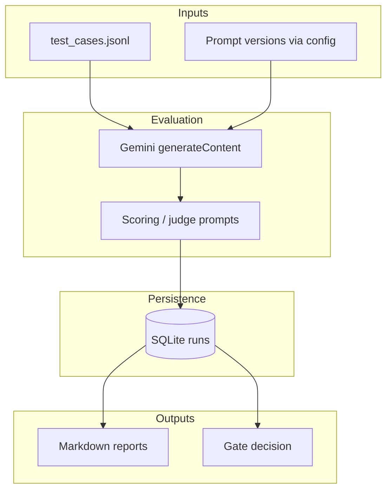

# Evaluation and governance for LLM campaign suggestions

This repository is a self-contained **Analytics Engineering** sample: a release-style **evaluation gate** for LLM-generated campaign recommendations. If you are reviewing it for a hiring decision, the quickest path is to read the **case study PDF** (source in [`report/LEGO_Case_Study_Report.tex`](report/LEGO_Case_Study_Report.tex); build instructions in [`report/README.md`](report/README.md)), then skim [`docs/case-study.md`](docs/case-study.md) and the code under `src/`.

---

## What you are looking at

| Area | What is implemented |
|------|----------------------|
| Evaluation | JSONL test suite; identical inputs for baseline vs. candidate; rubric-based scoring with a judge model |
| Regression | Aggregate and per-case comparisons; report artifacts for trends |
| Governance | Explicit gate outcomes (`PROMOTE` / `BLOCK` / conditional paths) driven by thresholds |
| Observability | Run history in SQLite; Markdown reports under `reports/` |
| Engineering | Python 3.10+, stdlib only for runtime (Gemini via REST); repeatable CLI entrypoints |

---

## Architecture (high level)



---

## Repository layout

| Path | Purpose |
|------|---------|
| `src/` | Configuration, LLM client, evaluation runner, scoring, persistence, gates, reporting |
| `scripts/` | Baseline/candidate runs, report generation, run comparison |
| `data/` | Test suites (`test_cases.jsonl`, `validation_suite.jsonl`, …) |
| `reports/` | Example generated Markdown outputs |
| `report/` | LaTeX case study (PDF builds locally or via Overleaf; see `report/overleaf/`) |
| `docs/` | Concise narrative aligned with the PDF |

Design notes and iteration history appear in `PHASE*.md` and `FINAL_DECISION_STORY.md`.

---

## Reproducing the evaluation (for technical review)

**Requirements:** Python 3.10+, and a Gemini API key from [Google AI Studio](https://aistudio.google.com/apikey). For a PDF from the LaTeX source: pdfLaTeX + TikZ, or Overleaf.

```bash
cd job-application-lego
cp env.example .env
# Set Gemini_API_KEY in .env (never committed; see .gitignore)
```

Optional variables are documented in `src/config.py` (`BASELINE_PROMPT_VERSION`, `CANDIDATE_PROMPT_VERSION`, `DATASET_PATH`, temperatures).

From the repository root:

```bash
python scripts/run_baseline.py
python scripts/run_candidate.py
python scripts/generate_report.py
```

Additional scripts: `compare_runs.py`, `generate_segment_report.py`, `generate_phase4_report.py`.

**PDF:** `cd report && ./build_pdf.sh` produces `LEGO_Case_Study_Report.pdf` when a LaTeX toolchain is available.

---

## Security and data

API keys belong in `.env` locally; that file is **not** tracked. `env.example` shows the variable names only. This sample does not include confidential LEGO data.

---

## License

See [LICENSE](LICENSE).
